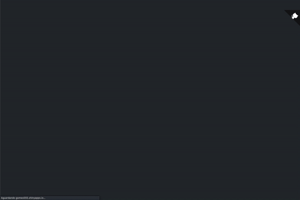
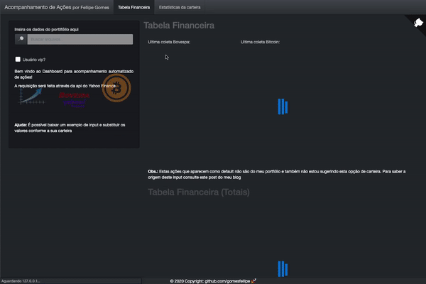
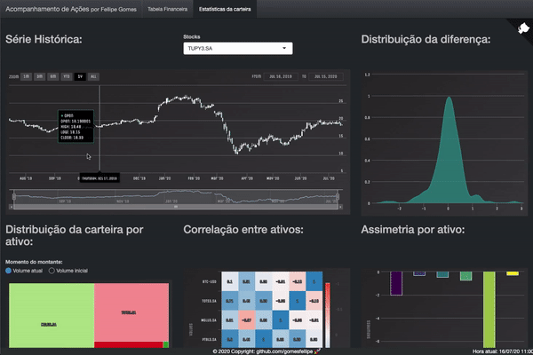

# acompanhacoes

**Atenção:** App em desenvolvimento! Para mais informações sobre os próximos passos consulte a aba de [Projects](https://github.com/gomesfellipe/acompanhacoes/projects)

---

O objetivo do pacote `acompanhacoes` é permitir a portabilidade de um dashboard desenvolvido para o acompanhamento de ativos de diferentes naturezas de forma prática no dia a dia. A idéia deste shiny foi inspirada [neste post](https://gomesfellipe.github.io/post/2020-03-25-investment-alert/investment-alert/) do meu blog. 

O Dashboard é uma POC ([proof of concept](https://en.wikipedia.org/wiki/Proof_of_concept)) de uma ferramenta que possibilita o acompanhamento automatizado da tabela financeira de um portifólio com a coleta de dados de cotações em tempo real, incluindo cálculo de Ganho/Perda (caso decida fazer a desmontagem no tempo atual) e análise automatizada do portifólio.

O app shiny foi desenvolvido utilizando o framework [`golem`](https://thinkr-open.github.io/golem/index.html) que trás uma série de configurações e facilitam na hora de implementar o app em produção. O app possui um script [Dockerfile](https://github.com/gomesfellipe/acompanhacoes/blob/master/Dockerfile) que é gerado automaticamente utilizando a função `golem::add_dockerfile()`.

Os dados são obtidos utilizando a função `quantmod::getQuote("<stock>")` para obter dados em tempo real (com defasagem de 15 minutos) e utilizando a função `quantmod::("<stock>", get = "stock.prices", from = first_day_year)` intradiários fornecidos pela api do [Yahoo Finance](https://finance.yahoo.com/) das cotações do dia anterior. 

## Instalação

Para instalar a versão de desenvolvimento do aplicativo execute o comando:

``` r
devtools::install_github("gomesfellipe/acompanhacoes", INSTALL_opts = '--no-lock')
```

Ou faça o download da pasta do repositório e execute:

``` r
devtools::install("/path_to/acompanhacoes")
```

## Uso

Após instalar o pacote, execute os comandos para executar o dashboard no R:

``` r
library(acompanhacoes)
run_app()
```
Veja como é a tela inicial do dashboard:


Para acessar o dashboard no meu servidor consulte: <https://gomes555.shinyapps.io/acompanhacoes/>

Assim que o dashboard for aberto, serão exibidos resultados para um portfólio __arbitrário__ fornecido como exemplo, exibindo **tabelas financeiras** com as seguitnes informações:

| Campo       | Subcampo        | Descrição                            | Medotologia                   |
| ----------: | :-------------- | :----------------------------------- | :---------------------------- |
| Montagem | Cotação inicio  | Valor no momento da compra           | *input*                       |
| Montagem | Quantidade      | Quantidade de lotes comprados        | *input*                       |
| Montagem | Volume Inicio   | Volume total da compra               | `cot_ini * qtd`               |
| Desmontagem | Cotacao Atual   | Valor do ativo no momento atual      | *real-time*                   |
| Desmontagem | Volume Atual    | Volume total atual                   | `cot_atual * qtd`             |
| Resultado | Ganho/Perda     | Valor de ganho/perda caso venda hoje | `vol_atual - vol_ini`         |
| Resultado | Resultado Bruno | Porcentagem de lucro                 | `ganho_perda / vol_ini * 100` |

A próxima seção trará as informações necessárias para se realizar a carga no Dashboad.

## Input

O dashboard tem 3 abordagens quanto ao input dos dados:

1. **Sem input**: O dashboard vai carregar a carteira exemplo que utilizei [neste post](https://gomesfellipe.github.io/post/2020-03-25-investment-alert/investment-alert/) do meu blog;
2. **Input manual**: O dashboard vai exibir as estatísticas baseadas no input do usuário;
3. **Usuário vip**: O dashboard vai exibir a carteira "reservada", pré-definida pelo desenvolvedor, após fornecer sua chave de acesso. 

Sempre que alguma dessas três ações forem executadas, os dados das cotações informadas no input serão coletados utilizando funções do pacote [`quantmod`](https://cran.r-project.org/web/packages/quantmod/), que fornecem as cotações via api do [Yahoo Finance](https://finance.yahoo.com/).

As seções a seguir ajudarão a entender como utiliza-los.

### 1. Sem input

O Dashboard carrega o conjunto de dados `acompanhacoes::input_exemplo` no momento que é inicializado com a finalidade de servir como exemplo e apresentação da ferramenta. Veja qual o formato do arquivo:

```
> acompanhacoes::input_exemplo
# A tibble: 3 x 3
  symbol   cot_ini     qtd
  <chr>      <dbl>   <dbl>
1 TUPY3.SA    24.4 200    
2 ELET3.SA    19.7 150    
3 BTC-USD  31747.    0.032
```

Obs.: Carteira elaborada de forma **arbitrária** para servir como exemplo

### 2. Input manual

O arquivo fornecido como input para o Dashboard precisa conter a palavra "portfolio" (como por exemplo: `input_portfolio.txt`) e estar no seguinte formato:

```
symbol, cot_ini, qtd
TUPY3.SA, 24.4, 200    
ELET3.SA, 19.7, 150
PTBL3.SA, 5.80, 100     
MGLU3.SA, 35.33, 100
TOTS3.SA, 19.28, 200
BTC-USD, 28000, 0.01
BTC-USD, 31747, 0.032
BTC-USD, 49499.37, 0.0101
```

Após definir sua cateira com os valores pagos no momento da compra e informar a quantidade comprada clique na lupa 🔎  para buscar o arquivo ou arraste para o campo indicado:



Sendo assim, os resultados serão exibidos em tempo real de forma automática. 

Obs.: O exemplo apresentado no gif é do arquivo [`portfolio_vip.txt`](https://github.com/gomesfellipe/acompanhacoes/blob/master/portfolio_vip.txt), que é carteira elaborada de forma **arbitrária** para servir como exemplo.

### 3. Usuário vip! ⭐  (Opcional)

Para habilitar o vip talvez pareça um pouco mais complicado porém pode ser um recurso muito útil para ajudar a acompanhar o investimentos pois possui a vantagem de permitir o acesso ao portfolio de forma protegida (eu mesmo tenho usado no meu dia a dia e aceito sugestões de melhora nesse mecanismo para facilitar a experiência do usuário). Trata-se de configurar dois arquivos no diretório raiz de modo que o dashboard só irá carregar caso seja informada a senha de acesso. 

Os dois arquivos de configuração são:

* `portifolio_vip.txt`:

Um arquivo na extensão `txt` com informações da cotação no momento da compra e a quantidade adquirida. Existe um [arquivo de exemplo](https://github.com/gomesfellipe/acompanhacoes/blob/master/portfolio_vip.txt) no repositório de forma que o desenvolvedor possa adaptar para sua carteira. 

**Dica**: Sugiro que o inclua o `.txt` no seu `.gitignore` caso deseje manter a privacidade da sua carteira na hora de fazer o versionamento);

* `vip.rds`:

Um objeto R do tipo vetor que contenha um ou mais elementos que serão utilizados como chave de acesso do arquivo `portifolio_vip.txt`.

Para criar o vetor defina a raíz do diretório como diretório de trabalho e execute os comandos:

```
vip <- c("senha")
saveRDS(vip, vip.rds)
```

Com estes dois arquivos definidos na pasta raiz do diretório do dashboard, execute os comandos para executar o Dashboard:

```
library(acompanhacoes)
run_app()
```



Parabéns! Se chegou té aqui agora você possui um Dashboard com um panorama geral de informações (quase) em tempo real para auxiliar na tomada de decisão no momento da desmontagem de algum ativo!

**Dica**: Caso queria publicar esse dashboard com 1 linha de código basta criar um usuário no site <https://www.shinyapps.io/>, seguir a instruções e subir a aplicação utilizando `rsconnect::deployApp()`.

## Estatísticas da carteira

Esta seção ainda esta em desenvolvimento e totalmente aberta à sugestões. Veja como é a tela de Estatísticas da carteira:



(Em desenvolvimento)

## Disclaimer

Os arquivos aqui apresentados não representam meu portfólio e também não estou sugerindo estas opções de carteiras. Para saber a origem deste input consulte o [post do meu blog](https://gomesfellipe.github.io/post/2020-03-25-investment-alert/investment-alert/) onde utilizo estes ativos como exemplo na construção de uma portfólio fictício. A idéia é que o usuário entre com os dados do seu portfólio para cada compra efetuada.

A responsabilidade de manter a privacidade da carteira é totalmente do usuário, mantenha o arquivo `portifolio_vip.txt` salvo em seu computador local e caso use controle de versões inclua este arquivo no seu arquivo `.gitignore`.

Nenhum arquivo inputado será persistido.

## Próximos passos

Para saber quais serão os próximos passos e saber como você pode contribuir com o desenvolvimento deste pacote consulte a aba de [Projects](https://github.com/gomesfellipe/acompanhacoes/projects) do github.

O pacote ainda esta em fase de desenvolvimento e quando estiver completo será submetido ao CRAN!

## Licença

Sinta-se a vontade para utilizar, reproduzir e modificar o código respeitando os [termos da licença](https://github.com/gomesfellipe/acompanhacoes/blob/master/LICENSE.md). 
