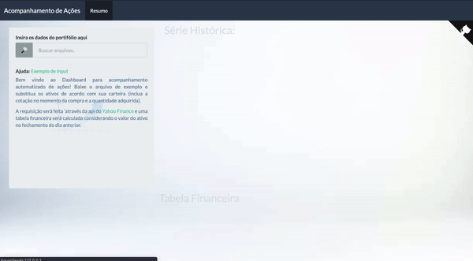

# acompanhacoes


**Atenção:** App em desenvolvimento! O readme será atualizado assim que as novas funcionalidades forem incluídas com sucesso!

---

O objetivo do pacote `acompanhacoes` é possibilitar a portabilidade do dashboard desenvolvido para o acompanhamento de ativos de diferentes naturezas. A idéia deste shiny foi inspirada [neste post](https://gomesfellipe.github.io/post/2020-03-25-investment-alert/investment-alert/) do meu blog.

O dashboard é uma POC ([proof of concept](https://en.wikipedia.org/wiki/Proof_of_concept)) para o desenvolvimento de um dispositivo que possibilite a automação do acompanhamento de ativos de renda variável. 

O app shiny foi desenvolvido utilizando o framework [`golem`](https://thinkr-open.github.io/golem/index.html) que trás uma série de configurações e facilitam na hora de implementar o app em produção. O app possui um script [Dockerfile](https://github.com/gomesfellipe/acompanhacoes/blob/master/Dockerfile) que é gerado automaticamente utilizando a função `golem::add_dockerfile()`.

Os dados das cotações serão coletados no momento do input do portfólio do usuário, utilizando a funcao `tidyquant::tq_get("<stocks>", get = "stock.prices", from = first_day_year)` que coleta os dados da api do [Yahoo Finance](https://finance.yahoo.com/) das cotações do dia anterior. 

Sinta-se a vontade para utilizar, reproduzir e modificar o código. O dashboard esta em desenvolvimento e qualquer ajuda será bem vinda!

## Instalação

Para instalar a versão de desenvolvimento do aplicativo execute os comandos:

``` r
devtools::install_github("gomesfellipe/acompanhacoes", INSTALL_opts = '--no-lock')
```

## Exemplo de input

Caso queira ver o exemplo de input para o dashboard, consulte os dados no pacote:

```
> acompanhacoes::input_exemplo
# A tibble: 3 x 3
  symbol   cot_ini     qtd
  <chr>      <dbl>   <dbl>
1 TUPY3.SA    24.4 200    
2 ELET3.SA    19.7 150    
3 BTC-USD  31747.    0.032
```

**Obs**.: Este não é meu portfólio e também não estou sugerindo esta opção de carteira. Para saber a origem deste input consulte o [post do meu blog](https://gomesfellipe.github.io/post/2020-03-25-investment-alert/investment-alert/) onde utilizo estes ativos como exemplo na construção de uma portfólio fictício. A idéia é que o usuário entre com os dados do seu portfólio para cada compra efetuada.


## Uso

Após instalar o pacote, execute os comandos para executar o dashboard no R:

``` r
library(acompanhacoes)
run_app()
```
Veja como é a tela do dashboard:



<small>[Link para testar o app na web](https://gomes555.shinyapps.io/acompanhacoes/)</small>

A tabela financeira informa: 

* Montagem (valores no momento da compra)
    * `Cotação inicio`: Valor do ativo na compra
    * `Quantidade`: Quantidade de lotes compradas
    * `Volume Inicio`: Volume total da compra
* Desmontagem (valores no momento da venda)
    * `Cotação Atual`: Valor do ativo no momento atual
    * `Volume Atual`: Volume total atual 
* Resultado
    * `Ganho/Perda`: Valor de ganho/perda caso venda hoje
    * `Resultado Bruto`: A razão entre o ganho/perda sobre o volume investido incialmente


## Limitações e próximos passos

Veja a seção de [Projetos](https://github.com/gomesfellipe/acompanhacoes/projects)

